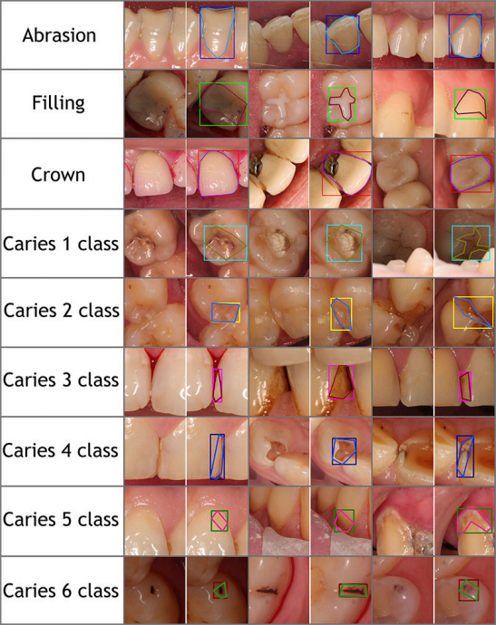
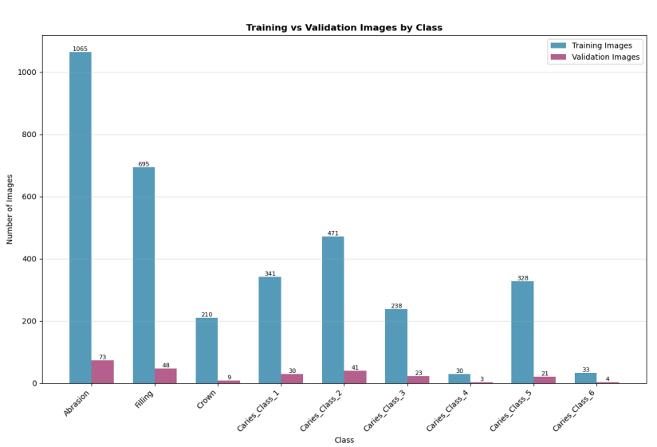
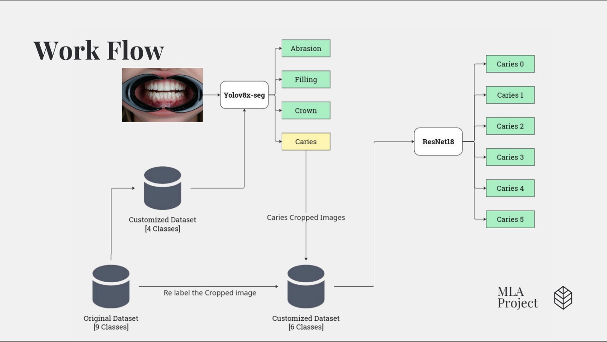
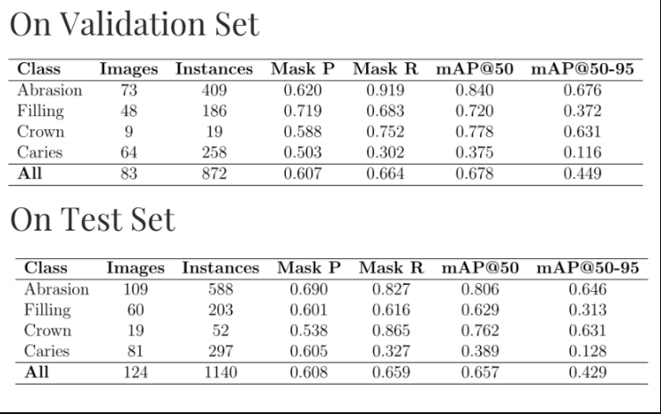
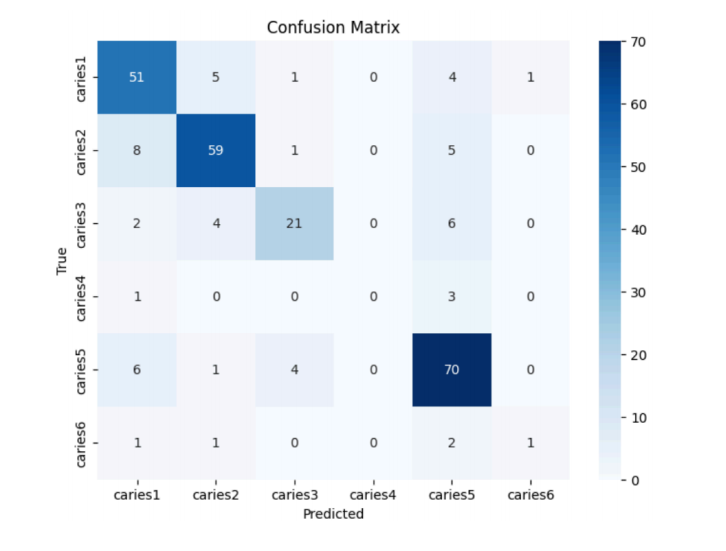
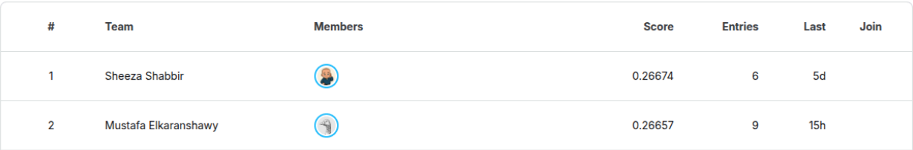

# AlphaDent: Teeth Marking

**Competition / Dataset**: AlphaDent – Teeth marking

## Overview

AlphaDent is a dataset / competition focused on **automated tooth pathology detection** using photographs of the oral cavity. The goal is to build models that can identify and segment different dental pathologies from images.

---

## Key Details

| Aspect | Detail |
|---|---|
| **Data Source** | Intraoral photographs taken with a DSLR camera (high resolution) from 295 patients.  |
| **Number of Images** | Over 1,200 images for training/validation; additional unseen test images. |
| **Task Type** | Instance segmentation of pathology / abnormal areas on teeth.  |
| **Number of Classes** | 9 pathology classes. |

---

## Pathology Classes

The nine classes include (but are not limited to):  

- Abrasion (mechanical wear of hard tissue)
- Filling (restorations)
- Crown (types like metal-ceramic, ceramic, zirconium)  
- Multiple types of caries (varying by location and severity)

---

## Data Splits & Labeling

- Training / validation split is done **by patient** (so images from same patient are not split across train/valid).
- Test data: Images are from new time period; labels are withheld (used for leaderboard evaluation).
- Labeling format: Masks / polygons per instance; also text-files with normalized boundary coordinates.

---

## Evaluation Metric

- The main metric is **mean Average Precision at IoU threshold 0.50** (mAP@50) across all pathology classes.
- Other metrics (e.g. for more strict IoU thresholds) may also be reported.

---

## Model Explanation

### Our Approach (Segmentation + Hierarical Classification)

- Combining the 6 classes of caries into a signle class called `Caries`.
- Use `Yolov8x-seg` as the enumeration and segmentation class to detect the 4 main classes (Abrasion, Filling, Crown, Caries)
- Pass the areas segmented as `Caries` and push it to `ResNet18` model to classify the class into the original 6 classes of caries

---

## Results

### Initial Segmentation Results

### Classifier Results

### Final Test Results (over the competition)

- We achieved the 2nd best team in the competition -till now- and wainting for more development.

## How to Get Started

1. Download dataset from Kaggle (train/valid images + labels) and separate test set.  
2. Analyze class distributions; decide whether to merge rare classes or apply class weightings.  
3. Preprocess images (resize, normalization, augmentations).  
4. Load Best Models from [Models](https://drive.google.com/drive/folders/1FN3Z2mDSt_CHtEFwxHIlL0YfVJQQFNzr?usp=sharing).
5. Train (if needed), validate (using mAP@50), tune hyperparameters.  
6. Test on withheld test set; submit predictions to Kaggle leaderboard.

---

## References

- “[AlphaDent](https://www.kaggle.com/competitions/alpha-dent): A dataset for automated tooth pathology detection” (Evgeniy I. Sosnin et al., 2025)
- [Segment Any Tooth](https://www.sciencedirect.com/science/article/pii/S1991790225000030)

---
